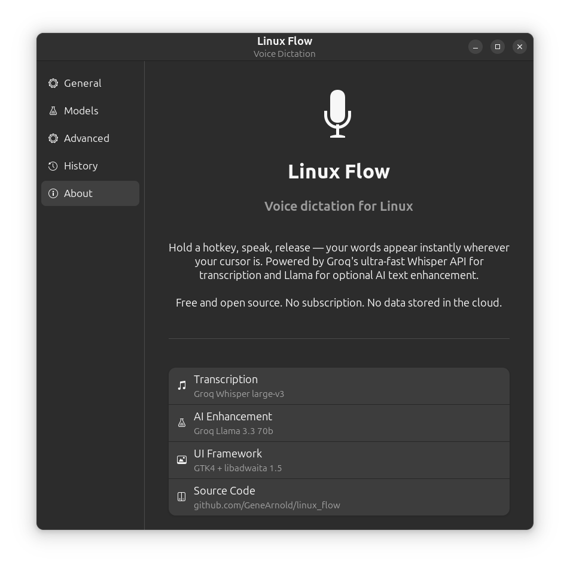
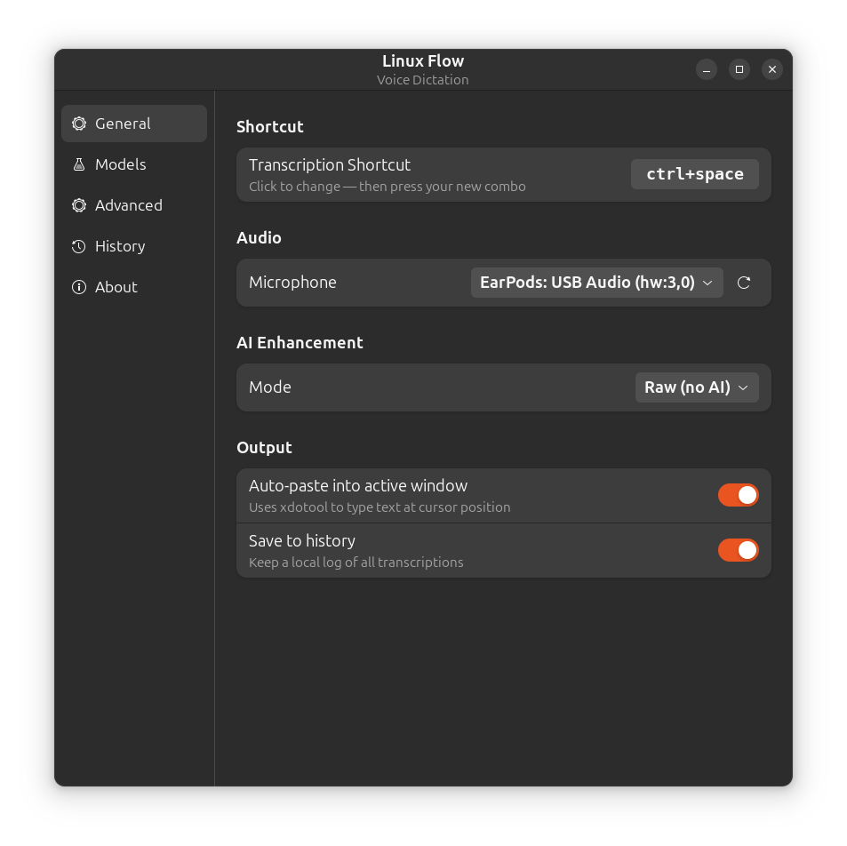
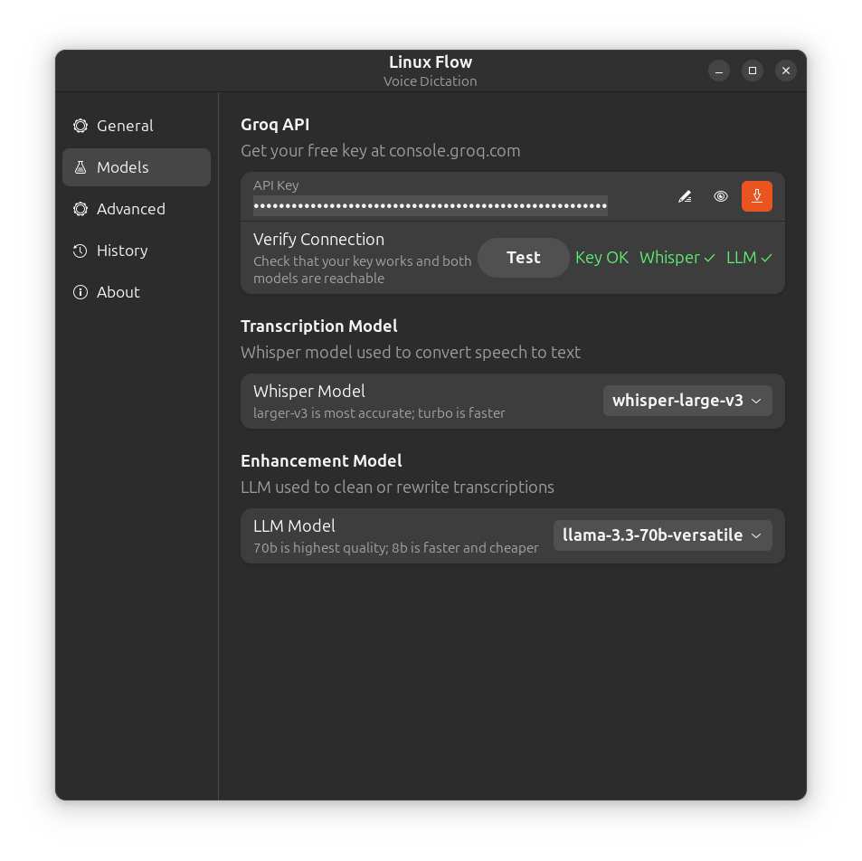
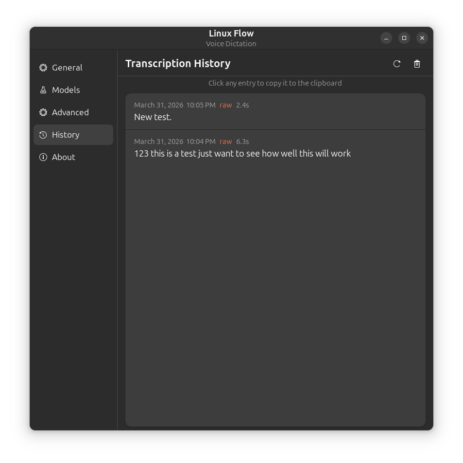
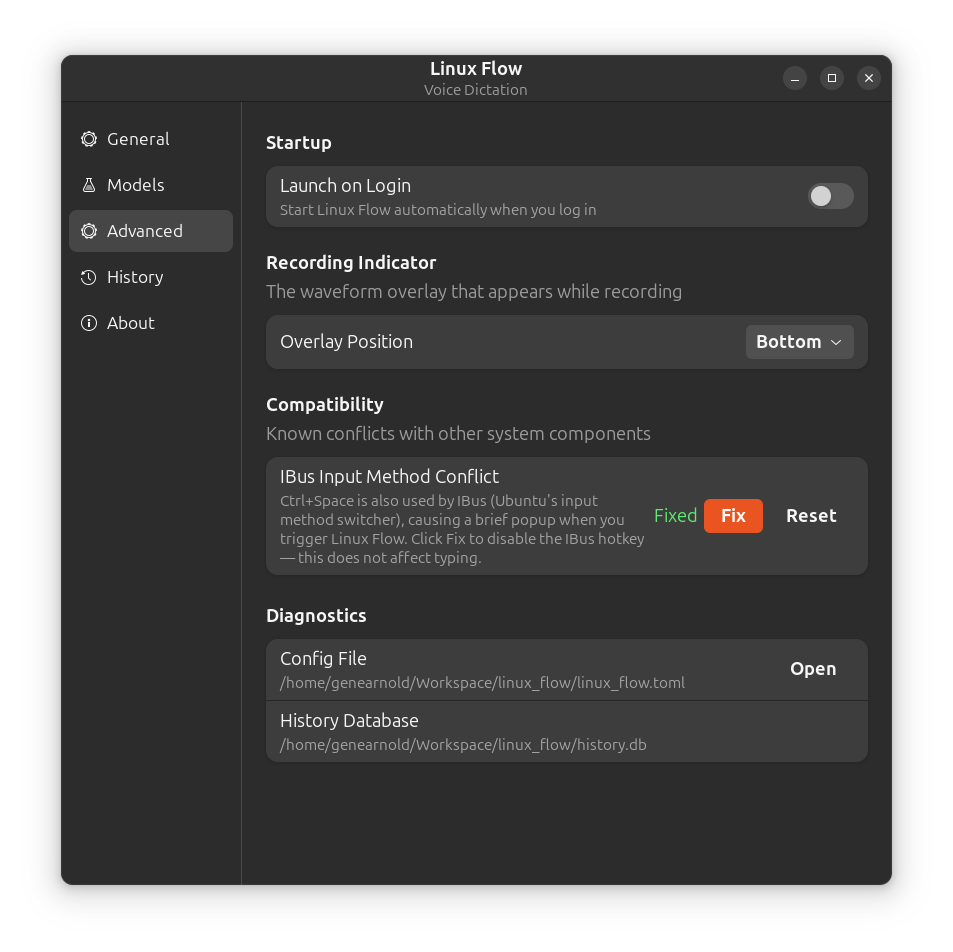
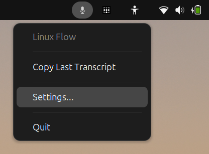

<p align="center">
  
</p>

# Linux Flow

**Hold a key, speak, release — your words appear wherever your cursor is.**

Linux Flow is a free, open-source voice dictation app for Linux. It captures your microphone, sends the audio to Groq's ultra-fast Whisper API for transcription, optionally polishes the result with a Llama LLM, and injects the text directly into whatever window you're typing in — no copy/paste required.



---

## Features

- **Hold-to-record** — hold your hotkey, speak, release. Done.
- **Instant transcription** — Groq Whisper returns results in under a second
- **AI enhancement modes** — Raw (exact words), Clean (fix grammar + remove filler words), or Rewrite (polished prose)
- **Auto-injects text** — types directly into the active window (xdotool on X11, wtype on Wayland)
- **History log** — every transcription saved locally in SQLite; browse and copy from the app
- **System tray** — runs in the background, accessible from the notification area
- **Waveform overlay** — floating mic indicator while recording
- **Configurable hotkey** — click to capture any combo you want
- **Mic selector** — pick any input device, supports PipeWire / PulseAudio / ALSA
- **Launch on Login** — built-in autostart toggle, no manual config needed

---

## Requirements

- Linux with X11 or Wayland session
- Python 3.12+
- A free [Groq API key](https://console.groq.com)

Tested on Ubuntu 24.04 (GNOME/X11) and Arch Linux (Wayland).

---

## Installation

### Ubuntu / Debian

```bash
# 1. Clone
git clone https://github.com/GeneArnold/linux_flow.git
cd linux_flow

# 2. Install system dependencies
sudo apt install xdotool xclip python3-gi python3-gi-cairo \
    gir1.2-gtk-4.0 gir1.2-adw-1 libgirepository1.0-dev gcc

# 3. Create virtual environment and install Python packages
python3 -m venv venv
source venv/bin/activate
pip install -r requirements.txt

# 4. Install icon and desktop entry (gives you the correct dock icon)
bash install.sh

# 5. Launch from your app menu, or run directly:
python main.py
```

### Arch Linux

```bash
# 1. Clone
git clone https://github.com/GeneArnold/linux_flow.git
cd linux_flow

# 2. Install system dependencies
sudo pacman -S python-gobject python-cairo gtk4 libadwaita \
    gobject-introspection gcc

# For X11 sessions:
sudo pacman -S xdotool xclip

# For Wayland sessions:
sudo pacman -S wl-clipboard wtype
sudo usermod -aG input $USER   # then log out and back in

# 3. Create virtual environment and install Python packages
python3 -m venv venv
source venv/bin/activate
pip install -r requirements.txt

# 4. Install icon and desktop entry
bash install.sh

# 5. Launch:
python main.py
```

On first launch, go to **Settings → Models**, paste your Groq API key, and click the save button. Hit **Verify Connection** to confirm everything is working.

---

## Screenshots

### General Settings
Configure your hotkey, microphone, AI enhancement mode, and output options.



### Models
Enter your Groq API key, choose Whisper and LLM models, and verify your connection.



### Transcription History
Every dictation is saved locally. Click any entry to copy it to the clipboard.



### Advanced Settings
Autostart, overlay position, IBus conflict fix, and diagnostic tools.



### System Tray
Runs silently in the background. Right-click to copy last transcript, open settings, or quit.



---

## Usage

| Action | How |
|---|---|
| Start recording | Hold `Ctrl+Space` (configurable) |
| Stop & transcribe | Release the hotkey |
| Change hotkey | Settings → General → click the combo button |
| Change mic | Settings → General → Microphone dropdown |
| AI enhancement | Settings → General → Mode (Raw / Clean / Rewrite) |
| Browse history | Settings → History |
| Enable autostart | Settings → Advanced → Launch on Login |

---

## Architecture

```
linux_flow/
├── main.py              Entry point. --list-mics flag for mic debugging.
├── config.py            TOML loader/writer with deep-merge defaults.
├── linux_flow.toml      User config (hotkey, mic, models, etc.)
│
├── core/
│   ├── engine.py        Orchestrates the full pipeline. Owns all workers.
│   ├── recorder.py      sounddevice mic capture → WAV bytes.
│   ├── transcriber.py   Groq Whisper API call.
│   └── enhancer.py      Groq Llama API call (clean / rewrite modes).
│
├── adapters/
│   ├── base.py          ABCs + factory functions (auto-detects X11 vs Wayland).
│   ├── x11.py           xdotool text injection + pynput hotkey listener.
│   └── wayland.py       wtype text injection + evdev hotkey listener.
│
├── db/
│   └── history.py       SQLite store for transcription history.
│
├── ui/
│   ├── app.py           Adw.Application — wires everything together.
│   ├── window.py        Settings window with sidebar navigation.
│   ├── overlay.py       Floating waveform indicator shown while recording.
│   ├── tray.py          Spawns tray_process.py as a subprocess.
│   ├── tray_process.py  Standalone pystray process (GTK3 isolation).
│   └── pages/           One file per settings page (General, Models, etc.)
│
└── assets/
    └── linux-flow.svg   App icon (installed by install.sh)
```

**Threading model:** The hotkey listener (pynput on X11, evdev on Wayland) runs on its own thread. When the hotkey fires, `_process()` runs on a fresh daemon thread so Groq API calls never block the UI or the listener. All UI callbacks use `GLib.idle_add()` to safely cross back onto the GTK main thread.

**GTK3/GTK4 isolation:** pystray uses AppIndicator3 (GTK3). Loading GTK3 and GTK4 in the same process crashes. The tray icon runs as a completely separate subprocess (`tray_process.py`) that communicates with the main app via JSON over stdin/stdout.

---

## Configuration

Edit `linux_flow.toml` directly or use the Settings UI. The API key is stored separately in a gitignored `.env` file:

```toml
[audio]
device_index = -1       # -1 = system default; run --list-mics to find yours

[hotkey]
modifiers = ["ctrl"]
key = "space"

[groq]
whisper_model = "whisper-large-v3"
llm_model = "llama-3.3-70b-versatile"

[enhancement]
mode = "raw"            # raw | clean | rewrite

[output]
auto_paste = true       # false = clipboard only
save_history = true
```

The API key is saved to `.env` (gitignored) when set via the UI, or you can set it manually:
```
GROQ_API_KEY="gsk_your_key_here"
```

---

## Known Limitations

- **Hotkey passthrough (X11)** — pynput is a passive listener on X11; the hotkey combo still reaches the active application. Apps that respond to `Ctrl+Space` (browsers, some IDEs) may show a brief popup. Fixing this requires an exclusive X11 key grab.
- **Wayland overlay positioning** — the recording overlay appears as a regular window positioned by the compositor rather than anchoring to a screen edge. Installing `gtk4-layer-shell` can improve this.
- **Wayland input group** — the evdev hotkey listener requires the user to be in the `input` group to read keyboard events.

---

## Contributing

Pull requests welcome. Open items:

- **REST API** — `api/` directory is scaffolded but empty. A simple FastAPI or Flask layer exposing `/transcribe` and `/history` endpoints would let other tools trigger dictation and pull history programmatically

---

## License

MIT
